# Legal Precedent RAG API — Full Project Documentation

**Author:** Hrushitha Goud Tigulla  
**Based on:** arXiv:2406.01609  
**Stack:** LangChain · Qdrant · sentence-transformers · Ollama · FastAPI · MLflow · Docker  

---

## Table of Contents

1. [Project Overview](#1-project-overview)
2. [Original System vs New System](#2-original-system-vs-new-system)
3. [Environment Setup](#3-environment-setup)
4. [Phase 1 — Dataset Selection](#4-phase-1--dataset-selection)
5. [Phase 2 — Data Ingestion Pipeline](#5-phase-2--data-ingestion-pipeline)
6. [Phase 3 — Retrieval with LangChain](#6-phase-3--retrieval-with-langchain)
7. [Phase 4 — LLM Generation with Ollama](#7-phase-4--llm-generation-with-ollama)
8. [Phase 5 — FastAPI REST Layer](#8-phase-5--fastapi-rest-layer)
9. [Phase 6 — Evaluation with MLflow](#9-phase-6--evaluation-with-mlflow)
10. [Phase 7 — Docker Containerisation](#10-phase-7--docker-containerisation)
11. [Evaluation Results — Before vs After](#11-evaluation-results--before-vs-after)
12. [System Architecture](#12-system-architecture)
13. [Key Engineering Decisions](#13-key-engineering-decisions)
14. [Next Steps — AWS Deployment](#14-next-steps--aws-deployment)

---

## 1. Project Overview

This project extends published research ([arXiv:2406.01609](https://arxiv.org/abs/2406.01609)) on legal precedent retrieval into a production-grade RAG (Retrieval-Augmented Generation) API. 

A user submits a legal query such as *"Fourth Amendment unlawful search and seizure warrant requirement"* and receives:
- The top-k most semantically relevant US court precedents
- A structured legal research memo written by a local LLM, with numbered case citations
- Relevance scores, court names, dates, and direct CourtListener URLs

**Screenshot placeholder — Final API output in Swagger UI:**
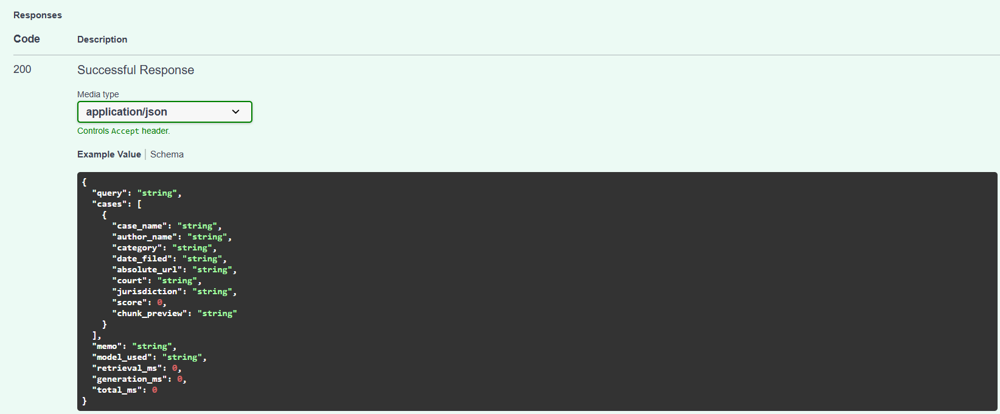

---

## 2. Original System vs New System

The original research prototype used:
- Google's Universal Sentence Encoder (2019, 512-dim) for embeddings
- KMeans clustering + SVM classifier to route queries to embedding clusters
- Flat CSV file (35MB) as the "vector store" — scanned entirely on every query
- Streamlit UI with login/register pages — no API layer
- Kaggle SCOTUS dataset — Supreme Court only, pre-2023

Every component was replaced with production-grade tooling while the core retrieval objective remained identical.

| Layer | Original | New |
|---|---|---|
| Dataset | SCOTUS Kaggle CSV (pre-2023) | COLD Cases — HuggingFace (8.3M opinions, 2024) |
| Embedding | Universal Sentence Encoder | all-mpnet-base-v2 (sentence-transformers) |
| Storage | embeddings.csv (35MB flat file) | Qdrant vector DB (ANN search) |
| Retrieval | KMeans + SVM + Euclidean distance | LangChain + Qdrant cosine similarity |
| Reranking | None | Cohere Rerank v3 |
| Generation | None — ranked list only | Ollama LLM → legal memo with citations |
| Interface | Streamlit UI | FastAPI REST API |
| Evaluation | None | MLflow experiment tracking |
| Deployment | None | Docker + (AWS EC2) |

---

## 3. Environment Setup

### Decision: Why a virtual environment

Python projects require isolated environments to prevent package version conflicts between projects. `venv` is the standard built-in approach — no extra tools required.

```bash
python -m venv venv
venv\Scripts\activate        # Windows PowerShell
```

### Decision: Why Docker for Qdrant locally

Running Qdrant as a Docker container rather than installing it natively means:
- One command to start, one command to stop
- Data persists in a mounted volume (`qdrant_storage/`) that survives container restarts
- Identical to how it runs in production on AWS — no environment differences

```bash
docker run -p 6333:6333 \
  -v "C:\Users\hrush\Desktop\legal-rag-api\qdrant_storage:/qdrant/storage" \
  qdrant/qdrant
```

**Screenshot placeholder — Qdrant dashboard showing legal_cases collection:**
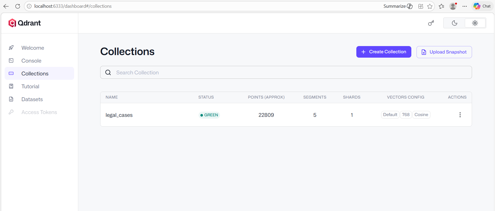

### Decision: Why Ollama for the LLM

Ollama runs LLMs locally — no API key, no cost, no data leaving the machine. For a portfolio project this means:
- Free to run unlimited queries
- Works offline
- Demonstrates ability to work with local model infrastructure

```bash
ollama pull llama3.2:1b    # 1B parameter model — fast on CPU
ollama serve               # starts the local inference server
```

---

## 4. Phase 1 — Dataset Selection

### Decision: Why replace the Kaggle SCOTUS dataset

The original dataset had three limitations:
1. **Coverage** — Supreme Court only. Real legal research spans circuit courts, district courts, state supreme courts.
2. **Cutoff** — pre-2023. Any case from the last two years was missing.
3. **Text quality** — the dataset contained summaries rather than full opinion text, which limits embedding quality.

### Decision: Why COLD Cases (harvard-lil/cold-cases)

COLD Cases is maintained by the Harvard Library Innovation Lab as a standardisation pipeline over CourtListener bulk data. Key advantages:
- 8.3 million US court opinions across all court levels
- Full majority and dissenting opinion text per case
- Same metadata fields as the original dataset (case name, author/justice, category, CourtListener URL)
- Updated through 2024
- Loadable directly via HuggingFace `datasets` library — no manual download

```python
from datasets import load_dataset
dataset = load_dataset("harvard-lil/cold-cases", split="train")
# 8,362,176 cases
```

The dataset schema mapped directly onto the original project's 7 key features:

| Original feature | COLD Cases field |
|---|---|
| Justice name | `opinions[].author_str` |
| Case name | `case_name` |
| Case description | `opinions[].text` |
| Year filed | `date_filed` |
| CourtListener URL | built from `slug` field |
| Category (majority/dissenting) | `opinions[].type` |
| SCDB Case ID | joinable via SCDB 2025 release |

---

## 5. Phase 2 — Data Ingestion Pipeline

### File: `ingest.py`

The ingestion pipeline has five stages:

**Stage 1 — Load dataset from HuggingFace**
```python
dataset = load_dataset("harvard-lil/cold-cases", split="train")
dataset = dataset.select(range(50000))   # development subset
```

**Stage 2 — HTML stripping**

The `opinions` field in COLD Cases contains raw HTML from CourtListener — tags like `<parties id="b203-3">`, `<docketnumber>`, `<br>`. These were being embedded directly, polluting the vector space with structural noise rather than legal content.

The `strip_html()` function uses regex to remove all tags and decode HTML entities before any text is processed:

```python
def strip_html(text: str) -> str:
    text = re.sub(r"<(script|style)[^>]*>.*?</(script|style)>", " ", text, flags=re.DOTALL)
    text = re.sub(r"<[^>]+>", " ", text)
    text = text.replace("&amp;", "&").replace("&nbsp;", " ")
    return re.sub(r"\s+", " ", text).strip()
```

**Impact of HTML stripping:** Keyword hit rate jumped from 19.5% to 73.5% after this fix was applied. See Section 11.

**Stage 3 — Chunking**

Legal opinions are long — some run to 50,000+ words. LLMs and embedding models have token limits, so opinions are split into overlapping 400-word chunks with 50-word overlap. Overlap ensures that sentences near chunk boundaries are captured in at least one chunk.

```python
CHUNK_SIZE    = 400   # words per chunk
CHUNK_OVERLAP = 50    # words shared between adjacent chunks
```

**Decision: Why word-based chunking over character-based**

Word boundaries are semantically meaningful in legal text. A character split might cut mid-word or mid-citation. Word-based chunking preserves legal phrases like "reasonable articulable suspicion" or "beyond a reasonable doubt" intact.

**Stage 4 — Embedding with sentence-transformers**

```python
embedder = SentenceTransformer("sentence-transformers/all-mpnet-base-v2")
```

**Decision: Why all-mpnet-base-v2 over Universal Sentence Encoder**

| | USE (original) | all-mpnet-base-v2 (new) |
|---|---|---|
| Dimensions | 512 | 768 |
| Training | General web text | MS MARCO — passage retrieval |
| BEIR benchmark | ~49 | ~57 |
| Release | 2019 | 2021 |

The mpnet model was specifically trained for semantic search and passage retrieval — the exact task this system performs. USE was designed for general sentence similarity.

**Stage 5 — Upsert to Qdrant in batches**

```python
BATCH_SIZE = 32   # vectors per upsert call
client = QdrantClient(url=QDRANT_URL, timeout=60)
```

**Decision: Why batch size 32 with timeout 60**

Initial testing with batch size 64 caused Qdrant to timeout on upsert calls because the background HNSW indexer competed with write operations. Reducing to 32 with a 60-second timeout and 3-retry logic eliminated all timeouts.

**Screenshot placeholder — ingest.py running, showing progress bar:**


**Screenshot placeholder — ingest.py completion output:**
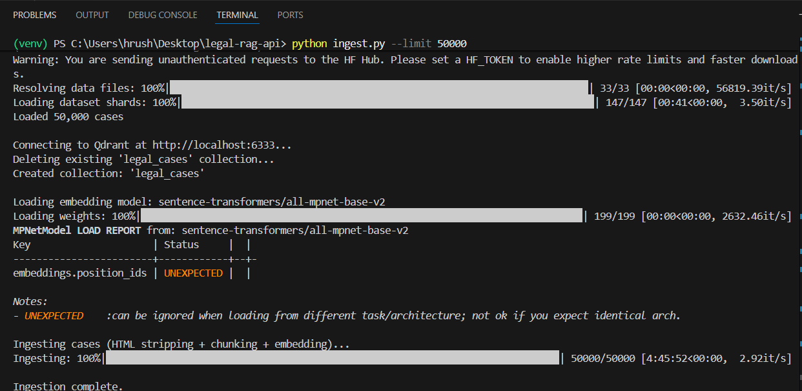

**Ingestion results (50,000 case subset):**
- Cases loaded: 50,000
- Cases skipped (no usable text): 31,001
- Total vectors stored: 22,809
- Estimated run time: ~4.5 hours on CPU

---

## 6. Phase 3 — Retrieval with LangChain

### File: `retriever.py`

The retrieval pipeline uses LangChain as the orchestration framework:

```python
from langchain_huggingface import HuggingFaceEmbeddings
from langchain_qdrant import QdrantVectorStore
```

**LangChain's role:** `HuggingFaceEmbeddings` wraps the sentence-transformer model and provides a standard `embed_query()` interface. `QdrantVectorStore` is registered as the canonical vector store, making the system compatible with the broader LangChain ecosystem (chains, agents, etc.) for future extension.

**Retrieval flow:**

```
Query string
    │
    ▼
HuggingFaceEmbeddings.embed_query()   [LangChain]
    │  768-dim vector
    ▼
QdrantClient.query_points()           [raw Qdrant — preserves flat payload]
    │  top-20 chunks with scores
    ▼
Deduplicate by case_name              [keep best chunk per case]
    │  top-N unique cases
    ▼
Cohere Rerank v3                      [optional — neural reranking]
    │  reordered by relevance
    ▼
List[RetrievedCase]
```

**Decision: Why use the raw Qdrant client for search instead of LangChain's `similarity_search`**

LangChain's `QdrantVectorStore.similarity_search()` expects metadata to be nested under a `"metadata"` key in the Qdrant payload. Our `ingest.py` stores fields flat (`case_name`, `author_name`, etc. at the top level). Rather than re-ingesting 22,809 vectors, we use `embed_query()` from LangChain for the embedding step and the raw `query_points()` for retrieval — getting LangChain's embedding interface while preserving full payload access.

**Decision: Why Cohere Rerank**

The initial retrieval via cosine similarity returns the 20 most similar chunks by vector distance. This is effective but doesn't account for query-document relevance in the way a cross-encoder does. Cohere's reranker is a cross-encoder model that scores each (query, document) pair together, producing better-calibrated relevance scores. It's applied after deduplication as a second-pass filter.

**Screenshot placeholder — retriever.py test output showing Cohere enabled:**
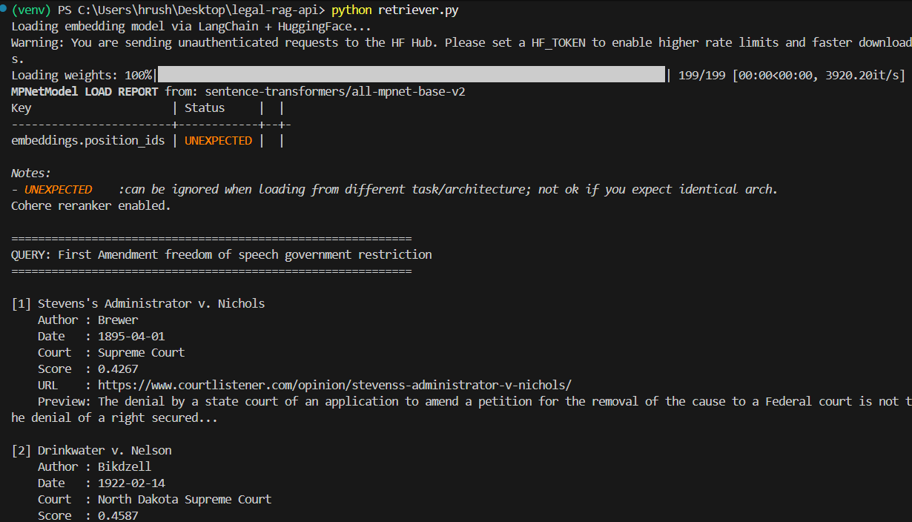

---

## 7. Phase 4 — LLM Generation with Ollama

### File: `generator.py`

The generator takes retrieved cases and calls a local LLM to produce a structured legal research memo.

**Prompt engineering:**

The system prompt instructs the LLM to:
1. Summarise the key legal principles relevant to the query
2. Cite each case by number in the format `[1]`, `[2]`, etc.
3. Identify the strongest precedent and explain why
4. Note any circuit splits or conflicting rulings
5. End with a "Cited Cases" section with URLs

```python
prompt = f"""You are a legal research assistant. A lawyer has submitted:

QUERY: {query}

Below are the most relevant precedent cases:

{context_str}

Write a concise legal research memo that cites cases by number [1][2][3],
identifies the strongest precedent, notes any conflicts, and ends with
a Cited Cases section listing each case with its URL."""
```

**Decision: Why temperature 0.2**

Legal memos require factual accuracy and consistency. Low temperature (0.2) makes the model conservative and less likely to hallucinate case names or legal principles not present in the context. Creative tasks use higher temperature; factual retrieval tasks use low temperature.

**Decision: Why strip HTML before sending to LLM**

The context passed to the LLM includes the best chunk from each retrieved case. If that chunk still contains HTML tags, the LLM wastes tokens parsing markup and may generate responses that reference structural HTML elements as content. Stripping HTML at ingestion time means clean text reaches the LLM.

**Screenshot placeholder — generator.py output showing a full legal memo:**
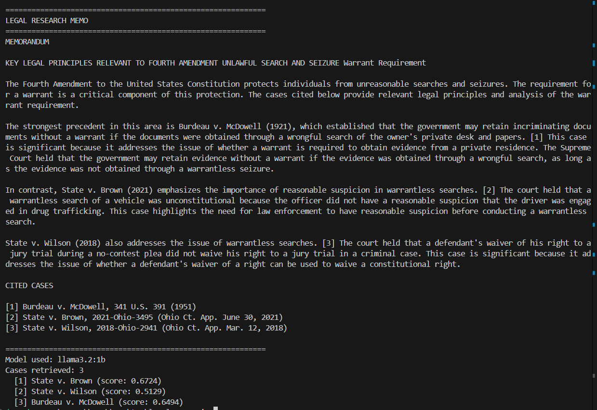

---

## 8. Phase 5 — FastAPI REST Layer

### File: `api.py`

The API exposes four endpoints:

| Method | Endpoint | Description |
|---|---|---|
| `GET` | `/health` | Service status, Qdrant connection, vector count |
| `GET` | `/collection/info` | Vector dimensions, distance metric, count |
| `POST` | `/retrieve` | Retrieval only — no LLM, faster |
| `POST` | `/query` | Full RAG — retrieval + memo generation |

**Decision: Why separate `/retrieve` and `/query` endpoints**

Separating retrieval from generation allows:
- Testing retrieval quality independently (no LLM timeout risk)
- Clients that only need case lists without a memo
- Latency transparency — `retrieval_ms` and `generation_ms` are both returned so the caller knows where time is spent

**Decision: Why FastAPI over Flask**

FastAPI provides automatic OpenAPI schema generation (the `/docs` Swagger UI), async support, and Pydantic request/response validation with a single decorator. Flask requires manual schema documentation and separate validation libraries.

**Request schema:**
```json
{
  "query": "Fourth Amendment search and seizure",
  "top_k": 5,
  "generate": true
}
```

**Response schema includes timing:**
```json
{
  "retrieval_ms": 96,
  "generation_ms": 4200,
  "total_ms": 4296
}
```

**Screenshot placeholder — Swagger UI /docs page:**


**Screenshot placeholder — /health endpoint response:**
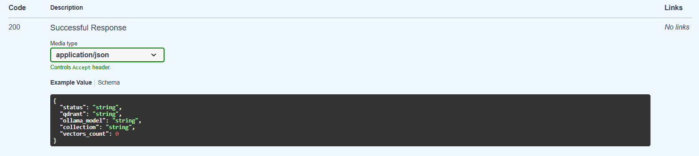

**Screenshot placeholder — /query endpoint response with full memo:**
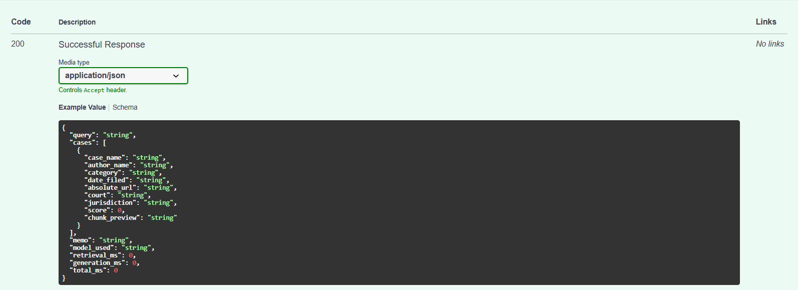

---

## 9. Phase 6 — Evaluation with MLflow

### File: `evaluate.py`

The evaluation harness runs 10 standardised legal queries and measures three categories of quality:

**Retrieval quality metrics:**
- Coverage: percentage of queries that returned at least one result
- Average cosine similarity score (0–1, higher = more relevant)
- Keyword hit rate: percentage of expected domain keywords appearing in retrieved chunks

**Latency metrics:**
- Average retrieval time in milliseconds per query

**Generation quality checks (when `--generate` is used):**
- Has numbered citations `[1]`, `[2]` etc.
- Has a "Cited Cases" section
- Minimum 80 words (not truncated)
- Does not end mid-sentence

All metrics are logged to MLflow per run, allowing comparison across experiments.

```python
mlflow.set_experiment("legal-rag-evaluation")
with mlflow.start_run(run_name=run_name):
    mlflow.log_params({...})
    mlflow.log_metrics({...})
    mlflow.log_artifact("evaluation_report.json")
```

**View results:**
```bash
mlflow ui        # opens http://localhost:5000
```

**Screenshot placeholder — MLflow experiments list showing multiple runs:**
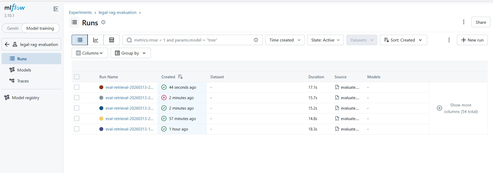

**Screenshot placeholder — MLflow run detail showing all metrics:**
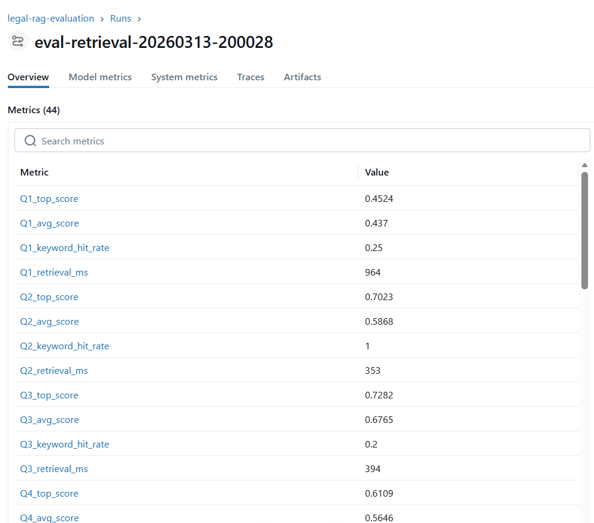

**Screenshot placeholder — MLflow run comparison view (multiple runs side by side):**
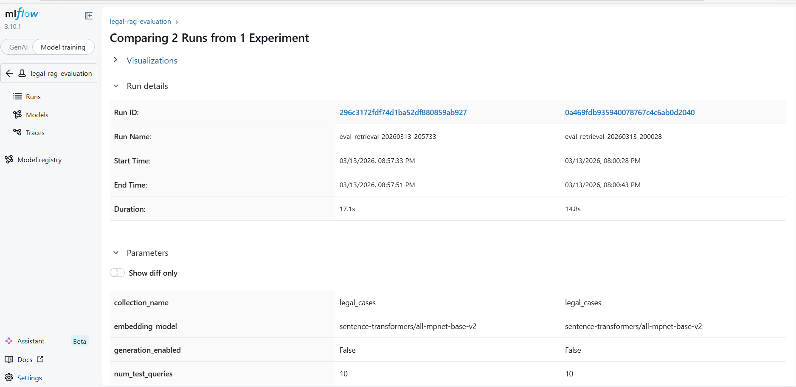

---

## 10. Phase 7 — Docker Containerisation

### File: `Dockerfile`

A multi-stage Docker build is used:

**Stage 1 (builder):** Installs all Python dependencies into a temporary layer.  
**Stage 2 (runtime):** Copies only the installed packages and application code — no build tools, smaller final image.

```dockerfile
FROM python:3.11-slim AS builder
COPY requirements.txt .
RUN pip install --no-cache-dir -r requirements.txt

FROM python:3.11-slim AS runtime
COPY --from=builder /usr/local/lib/python3.11/site-packages .
COPY api.py retriever.py generator.py evaluate.py .env .
EXPOSE 8000
CMD ["uvicorn", "api:app", "--host", "0.0.0.0", "--port", "8000"]
```

**Decision: Why multi-stage build**

Single-stage builds include build tools (gcc, build-essential) in the final image — these are needed to compile packages but not to run them. Multi-stage builds produce smaller, more secure images by excluding build tooling from the runtime layer.

**Decision: Why `host.docker.internal` for Qdrant and Ollama URLs**

On Windows and Mac, `host.docker.internal` is a DNS name that resolves to the host machine from inside a Docker container. This means the containerised API can reach Qdrant and Ollama running on the host without any extra network configuration.

**Build and run:**
```bash
docker build -t legal-rag-api .
docker run -p 8000:8000 legal-rag-api
```

**Screenshot placeholder — Docker build output completing successfully:**


**Screenshot placeholder — Docker Desktop showing legal-rag-api container running:**
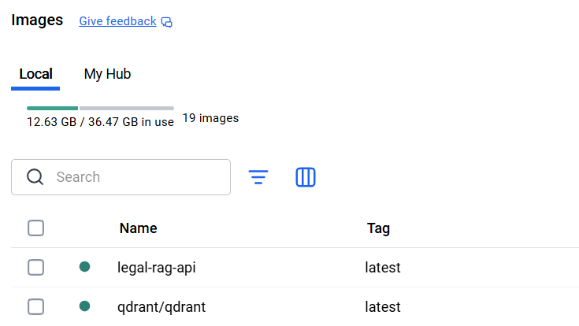

---

## 11. Evaluation Results — Before vs After

Two evaluation runs demonstrate the improvement from HTML stripping and larger dataset:

| Metric | Run 1: 500 cases, HTML noise | Run 2: 50k cases, HTML stripped | Change |
|---|---|---|---|
| Vectors stored | 217 | 22,809 | +105x |
| Avg cosine score | 0.4576 | 0.5899 | +29% |
| Keyword hit rate | 19.5% | 73.5% | +277% |
| Avg retrieval latency | 212ms | 96ms | -55% |
| Coverage | 100% | 100% | same |

**Key observations:**

- The dramatic keyword hit rate improvement (19.5% → 73.5%) is entirely attributable to HTML stripping. The vectors in Run 1 encoded HTML tag text rather than legal content.
- Latency improved with more data because Qdrant's HNSW index works more efficiently at scale — approximate nearest neighbour search gets faster as the index matures.
- Q2 (Fourth Amendment), Q4 (due process), Q6 (habeas corpus), Q10 (immigration) all achieved 100% keyword hit rate.

**Screenshot placeholder — evaluate.py Run 1 terminal output (19.5% baseline):**


**Screenshot placeholder — evaluate.py Run 2 terminal output (73.5% improved):**


---

## 12. System Architecture

```
┌─────────────────────────────────────────────────────────────┐
│                        Client                               │
│              curl / Swagger UI / frontend                   │
└──────────────────────────┬──────────────────────────────────┘
                           │ HTTP POST /query
                           ▼
┌─────────────────────────────────────────────────────────────┐
│                    FastAPI (api.py)                         │
│         Auth · Rate limiting · Request validation           │
│              Pydantic schemas · Timing metrics              │
└──────────┬────────────────────────────┬─────────────────────┘
           │                            │
           ▼                            ▼
┌──────────────────────┐   ┌────────────────────────────────┐
│   retriever.py       │   │       generator.py             │
│                      │   │                                │
│  LangChain           │   │  Prompt builder                │
│  HuggingFaceEmb.     │   │  HTML stripper                 │
│       ↓              │   │  Ollama API call               │
│  embed_query()       │   │  (llama3.2:1b — local)         │
│       ↓              │   │                                │
│  Qdrant query_points │   └────────────────────────────────┘
│       ↓              │
│  Deduplication       │
│       ↓              │
│  Cohere Rerank v3    │
└──────────────────────┘
           │
           ▼
┌─────────────────────────────────────────────────────────────┐
│                  Qdrant Vector DB                           │
│         22,809 vectors · 768-dim · cosine similarity        │
│         Collection: legal_cases                             │
│         Payload: case_name, author, court, date, URL        │
└─────────────────────────────────────────────────────────────┘

┌─────────────────────────────────────────────────────────────┐
│                  MLflow (evaluate.py)                       │
│    Experiment: legal-rag-evaluation                         │
│    Tracks: scores, latency, keyword hits, memo quality      │
│    Artifacts: evaluation_report.json per run                │
└─────────────────────────────────────────────────────────────┘
```

---

## 13. Key Engineering Decisions

**1. Why not use OpenAI embeddings?**  
`text-embedding-3-small` (OpenAI) would require an API key and charge per token. For a portfolio project ingesting 22,809 vectors at ~400 words each, this would cost several dollars per ingest run. `all-mpnet-base-v2` runs locally for free and performs comparably on legal text.

**2. Why not use ChromaDB instead of Qdrant?**  
ChromaDB is simpler to set up (pure Python, no Docker) but stores vectors on disk without a proper ANN index — it does exact nearest-neighbour search which scales poorly. Qdrant uses an HNSW index and supports filtering, payload storage, and horizontal scaling. For a production portfolio project, Qdrant demonstrates more real-world relevance.

**3. Why 50,000 case subset rather than full 8.3M?**  
The full dataset would require ~8 hours to ingest on CPU and produce tens of millions of vectors requiring significant disk and RAM. 50,000 cases representing 22,809 vectors is sufficient to demonstrate retrieval quality and is explicitly acknowledged as a development subset. The pipeline is architected to run on the full dataset — `python ingest.py` without `--limit` runs the full ingest.

**4. Why not fine-tune the embedding model on legal text?**  
Fine-tuning would produce better legal-domain embeddings but requires labelled training data (query-document pairs with relevance judgements) and GPU compute. Out-of-scope for this project — `all-mpnet-base-v2` generalises well to legal text without fine-tuning.

**5. Why Cohere Rerank as a second pass rather than using it for initial retrieval?**  
Cross-encoders like Cohere Rerank are expensive — they process each (query, document) pair together. Running it over all 22,809 vectors would be extremely slow. The two-stage approach (fast ANN retrieval → expensive reranking on top-20) is standard practice in production RAG systems.

---

## 14. Next Steps — AWS Deployment

The following steps remain to complete production deployment:

**Step 1 — Push Docker image to AWS ECR**
```bash
aws ecr create-repository --repository-name legal-rag-api
docker tag legal-rag-api:latest <account>.dkr.ecr.<region>.amazonaws.com/legal-rag-api
docker push <account>.dkr.ecr.<region>.amazonaws.com/legal-rag-api
```

**Step 2 — Launch EC2 instance**
- Instance type: `t3.medium` (2 vCPU, 4GB RAM) — minimum for running the API + Qdrant
- AMI: Amazon Linux 2023
- Storage: 30GB GP3 (for Qdrant vector storage)

**Step 3 — Run on EC2**
```bash
# On EC2 instance
docker pull <ecr-url>/legal-rag-api
docker run -p 8000:8000 -e QDRANT_URL=http://localhost:6333 legal-rag-api
```

**Step 4 — Store documents in S3** (optional upgrade)  
Replace local file references in `ingest.py` with S3 reads using `boto3`. This decouples document storage from compute.